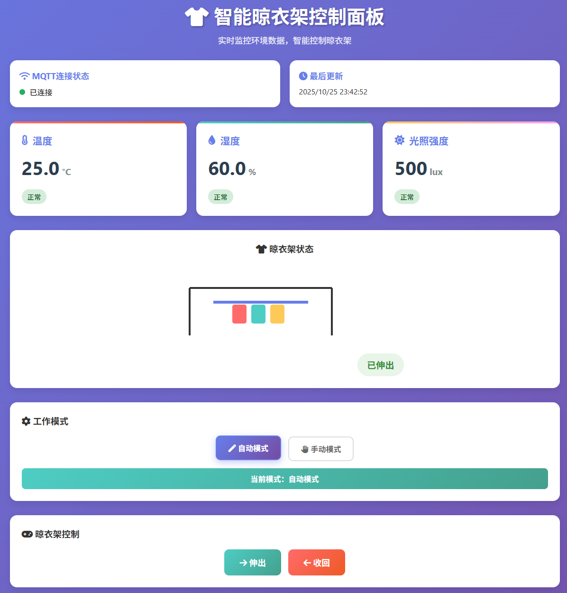

# 智能晾衣架物联网控制系统

## 🖥️ 系统界面展示

<div align="center">
  
  <p><em>智能晾衣架Web控制面板 - 实时监控环境数据，智能控制晾衣架</em></p>
</div>

### 界面功能特色

- 🌡️ **实时环境监控**: 显示温度、湿度、光照强度等环境参数
- 📡 **MQTT 连接状态**: 实时显示设备连接状态和最后更新时间
- 🏠 **晾衣架状态**: 可视化显示晾衣架当前状态（伸出/收回）
- ⚙️ **工作模式切换**: 支持自动模式和手动模式切换
- 🎮 **手动控制**: 提供伸出/收回按钮进行手动操作
- 📊 **数据可视化**: 清晰的卡片式布局展示各项数据

## 📖 项目简介

这是一个基于物联网技术的智能晾衣架控制系统，能够根据环境条件自动控制晾衣架的伸缩，并提供 Web 端远程监控和控制功能。系统采用多层架构设计，包含传感器数据采集、无线通信、云端数据处理和 Web 可视化界面。

## 🏗️ 系统架构

```
┌─────────────────┐    UART     ┌─────────────────┐    WiFi/MQTT    ┌─────────────────┐
│   STM32F103     │ ◄─────────► │   ESP32-C3      │ ◄─────────────► │   Web服务器     │
│   (传感器控制)   │             │   (通信网关)     │                 │   (数据处理)     │
└─────────────────┘             └─────────────────┘                 └─────────────────┘
        │                               │                                   │
        ▼                               ▼                                   ▼
┌─────────────────┐             ┌─────────────────┐                 ┌─────────────────┐
│ • DHT11温湿度   │             │ • WiFi连接      │                 │ • Flask Web服务 │
│ • BH1750光照    │             │ • MQTT通信      │                 │ • SQLite数据库  │
│ • 雨量传感器    │             │ • 数据转发      │                 │ • 实时监控界面  │
│ • SG90舵机     │             │ • 指令处理      │                 │ • 历史数据分析  │
│ • OLED显示屏   │             └─────────────────┘                 └─────────────────┘
└─────────────────┘
```

## 🔧 硬件组成

### STM32F103 主控模块

- **主控芯片**: STM32F103C8T6
- **传感器模块**:
  - DHT11: 温湿度检测
  - BH1750: 光照强度检测
  - 雨量传感器: 降雨检测
- **执行器**: SG90 舵机 (控制晾衣架伸缩)
- **显示器**: OLED 显示屏 (本地状态显示)
- **通信接口**: UART1 (与 ESP32 通信)

### ESP32-C3 通信模块

- **主控芯片**: ESP32-C3
- **无线通信**: WiFi 802.11 b/g/n
- **协议支持**: MQTT
- **通信接口**: UART1 (与 STM32 通信)

## 💻 软件架构

### 1. STM32 固件 (`stm32/liangyijia/`)

- **Core/**: STM32 HAL 库核心代码
  - `main.c`: 主程序入口
  - `app.c/app.h`: 应用层逻辑
- **BSP/**: 板级支持包
  - `dht11/`: 温湿度传感器驱动
  - `bh1750/`: 光照传感器驱动
  - `oled/`: OLED 显示屏驱动

**主要功能**:

- 传感器数据采集 (温度、湿度、光照、雨量)
- 智能控制算法 (自动/手动模式)
- 舵机控制 (晾衣架伸缩)
- UART 通信 (与 ESP32 数据交换)
- OLED 状态显示

### 2. ESP32 固件 (`esp32/liangyijia/main/`)

- `main.c`: 主程序和 WiFi 管理
- `mqtt_service.c/h`: MQTT 通信服务
- `uart_service.c/h`: UART 通信服务
- `app_config.h`: 系统配置参数
- `app_types.h`: 数据结构定义

**主要功能**:

- WiFi 网络连接管理
- MQTT 消息发布/订阅
- 传感器数据转发
- 远程控制指令处理
- 系统状态监控

### 3. Web 服务端 (`mqtt-web/`)

- `app.py`: Flask 主应用程序
- `run.py`: 服务启动脚本
- `templates/index.html`: Web 界面模板
- `static/lib/`: 前端依赖库

**主要功能**:

- RESTful API 接口
- MQTT 消息处理
- SQLite 数据存储
- WebSocket 实时通信
- 用户认证管理
- 数据可视化

## 📊 数据流程

### 数据采集流程

```
传感器 → STM32采集 → UART传输 → ESP32接收 → MQTT发布 → Web服务器 → 数据库存储
```

### 控制指令流程

```
Web界面 → HTTP请求 → Flask处理 → MQTT发布 → ESP32接收 → UART传输 → STM32执行
```

## 🌐 通信协议

### UART 通信协议 (STM32 ↔ ESP32)

**数据帧格式** (8 字节):

```
字节0: 帧头 (0xAA)
字节1: 温度值 (°C, uint8)
字节2: 湿度值 (%, uint8)
字节3-4: 光照强度 (lux, uint16大端序)
字节5: 晾衣架状态 (0=收缩, 1=伸展)
字节6: 工作模式 (0=自动, 1=手动)
字节7: 帧尾 (0xCC)
```

**控制指令**:

- `0x3B`: 晾衣架伸展
- `0x5E`: 晾衣架收缩
- `0xA0`: 切换自动模式
- `0xA1`: 切换手动模式

### MQTT 通信协议 (ESP32 ↔ Web 服务器)

**主题结构**:

```
smart_clothesline/{DEVICE_ID}/sensors     # 传感器数据
smart_clothesline/{DEVICE_ID}/control     # 控制指令
smart_clothesline/{DEVICE_ID}/mode/set    # 模式设置
smart_clothesline/{DEVICE_ID}/status      # 设备状态
```

**消息格式** (JSON):

```json
{
  "temperature": 25.5,
  "humidity": 60.0,
  "light": 500,
  "clothesline_status": "extend",
  "work_mode": "auto",
  "timestamp": 1640995200000
}
```

## 🚀 快速开始

### 环境要求

- **STM32 开发**: Keil5
- **ESP32 开发**: ESP-IDF 5.1.6+
- **Web 服务**: Python 3.10, Flask, SQLite

### 硬件连接

```
STM32F103 ↔ ESP32-C3:
  PA9 (UART1_TX) → GPIO1 (UART1_RX)
  PA10 (UART1_RX) → GPIO0 (UART1_TX)
  GND → GND
```

### 软件配置

#### 1. STM32 固件编译

```bash
# 使用Keil MDK-ARM打开项目
cd stm32/liangyijia/
# 打开 liangyijia.uvprojx
# 编译并下载到STM32
```

#### 2. ESP32 固件编译

```bash
cd esp32/liangyijia/
# 配置WiFi和MQTT参数
vim main/app_config.h

# 编译和烧录
idf.py build
idf.py flash monitor
```

#### 3. Web 服务启动

```bash
cd mqtt-web/
# 安装依赖
pip install flask flask-socketio flask-sqlalchemy paho-mqtt

# 启动服务
python run.py
# 访问 http://localhost:5000
```

### 默认配置

- **MQTT 服务器**: `broker.emqx.io:1883`
- **Web 登录**: `admin/admin123`, `user/user123`, `manager/manager456`

## 📱 功能特性

### 🤖 智能控制

- **自动模式**: 根据天气条件自动控制晾衣架
  - 检测到雨水 → 自动收回
  - 天气晴朗 → 自动伸展
- **手动模式**: 用户远程手动控制
- **实时监控**: 温度、湿度、光照强度实时显示

### 🌐 Web 管理界面

- **实时数据**: WebSocket 推送实时传感器数据
- **历史记录**: 数据图表展示和历史查询
- **远程控制**: 一键控制晾衣架伸缩
- **模式切换**: 自动/手动模式切换
- **用户管理**: 多用户登录和权限管理

### 📊 数据分析

- **SQLite 数据库**: 本地数据持久化存储
- **图表展示**: Chart.js 数据可视化
- **历史查询**: 按时间范围查询历史数据
- **数据导出**: 支持数据导出功能

## 🔧 系统配置

### 网络配置

```c
// esp32/liangyijia/main/app_config.h
#define WIFI_SSID "your_wifi_ssid"
#define WIFI_PASSWORD "your_wifi_password"
#define MQTT_BROKER_URI "mqtt://your_broker:1883"
#define DEVICE_ID "your_device_id"
```

### 传感器参数

```c
// 数据采集间隔
#define SENSOR_UPDATE_INTERVAL_MS 2000

// UART通信参数
#define UART_BAUD_RATE 115200
#define UART_BUF_SIZE 2048
```

### Web 服务配置

```python
# mqtt-web/app.py
DATA_COLLECTION_INTERVAL = 5  # 数据采集间隔(秒)
FRONTEND_REQUEST_INTERVAL = 30  # 前端请求间隔(秒)
HISTORY_DATA_COUNT = 10  # 历史数据显示数量
```

## 🛠️ 开发指南

### 添加新传感器

1. 在 STM32 BSP 目录添加驱动文件
2. 修改`app.c`中的数据采集函数
3. 更新 UART 通信协议
4. 修改 ESP32 的数据解析逻辑
5. 更新 Web 界面显示

### 扩展控制功能

1. 定义新的控制指令码
2. 在 STM32 中添加指令处理
3. 在 ESP32 中添加 MQTT 订阅
4. 在 Web 端添加控制接口

## 📈 性能指标

- **数据采集频率**: 2 秒/次
- **通信延迟**: <100ms (局域网)
- **数据存储**: SQLite 本地存储
- **并发用户**: 支持多用户同时访问
- **系统稳定性**: 7×24 小时连续运行

## 🔍 故障排除

### 常见问题

**1. ESP32 无法连接 WiFi**

- 检查 WiFi SSID 和密码配置
- 确认 WiFi 信号强度
- 查看串口调试信息

**2. MQTT 连接失败**

- 检查网络连接
- 确认 MQTT 服务器地址
- 查看防火墙设置

**3. 传感器数据异常**

- 检查传感器接线
- 确认电源供电
- 查看 UART 通信状态

**4. Web 界面无法访问**

- 检查 Python 环境和依赖
- 确认端口 5000 未被占用
- 查看服务器启动日志

## 📄 许可证

本项目采用 MIT 许可证 - 查看 [LICENSE](LICENSE) 文件了解详情。

## 👥 贡献者

- **开发者**: 邓皓阳
- **开发时间**: 2025 年 10 月

## 📞 联系方式

**注意**: 请在使用前仔细阅读硬件连接说明，确保正确连接以避免设备损坏。
